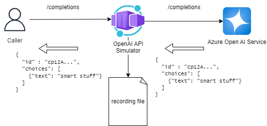

# Azure OpenAI API Simulator 

This repo is an exploration into creating a simulated API implementation for Azure OpenAI (AOAI). 

WARNING: This is a work in progress!

## Table of Contents

- [Azure OpenAI API Simulator](#azure-openai-api-simulator)
  - [Table of Contents](#table-of-contents)
  - [Overview](#overview)
    - [What is the Azure OpenAI API Simulator?](#what-is-the-azure-openai-api-simulator)
    - [Simulator Modes](#simulator-modes)
      - [Record/Replay Mode](#recordreplay-mode)
      - [Generator Mode](#generator-mode)
  - [Read More](#read-more)
  - [Changelog](#changelog)
  - [Contributing](#contributing)
  - [Trademarks](#trademarks)

## Overview

### What is the Azure OpenAI API Simulator?

The Azure OpenAI API Simulator is a tool that allows you to easily deploy endpoints that simulate the OpenAI API.
A common use-case for the simulator is to test the behaviour your application under load. Let's illustrate this with an example...

Let's assume that you have build a chatbot that uses the OpenAI API to generate responses to user queries. Before your chatbot becomes popular, you want to ensure that it can handle a large number of users. One of the factors that will impact whether your chatbot can gracefully handle such load will be the way that your chatbot handles calls to OpenAI. However, when load testing your chatbot there are a number of reasons why you might not want to call the OpenAI API directly:

- **Cost**: The OpenAI API is a paid service, and running load tests against it can be expensive.
- **Consistency**: The OpenAI API is a live service, and the responses you get back can change over time. This can make it difficult to compare the results of load tests run at different times.
- **Rate Limits**: The OpenAI API has rate limits, and running load tests against it can cause you to hit these limits.
- **Latency**: The latency of OpenAI API calls might change over time, and this can impact the results of your load tests.

In fact, when considering Rate Limits and Latency, these might be things that you'd like to control. You may also want to inject latency, or inject rate limit issues, so that you can test how your chatbot deals with these issues.

**This is where the Azure OpenAI API Simulator plays it's part!**

By using the Azure OpenAI API Simulator, you can reduce the cost of running load tests against the OpenAI API and ensure that your application behaves as expected under different conditions.

### Simulator Modes

The simulator has two approaches to simulating API responses: record/replay and generators.
If you don't have any requirements around the content of the responses, the generator approach is probably the easiest for  you to use.
If you need to simulate specific responses, then the record/replay approach is likely the best fit for you.

#### Record/Replay Mode

With record/replay, the API can be run in record mode to act as a proxy between your application and Azure OpenAI, and it will record requests that are sent to it along with the corresponding response from OpenAI. 

Once recorded, the API can be run in replay mode to use the saved responses without forwarding to Azure OpenAI. The recordings are stored in YAML files which can be edited if you want to customise the responses.

#### Generator Mode

The simulated API can also be run in generator mode, where responses are generated on the fly. This is useful for load testing scenarios where it would be costly/impractical to record the full set of responses.

## Read More

There are various options for [running and deploying](./docs/running-deploying.md) the simulator, including running in Docker and deploying to Azure Container Apps.

There are a range of [configuration options](./docs/config.md) that can be applied to control the simulator behavior.

The simulated API supports [extensions](./docs/extensions.md) that allow you to customise the behaviour of the API. Extensions can be used to modify the request/response, add latency, or even generate responses.

## Changelog

For a list of tagged versions and changes, see the [CHANGELOG.md](./CHANGELOG.md) file.

## Contributing

This project welcomes contributions and suggestions.  Most contributions require you to agree to a
Contributor License Agreement (CLA) declaring that you have the right to, and actually do, grant us
the rights to use your contribution. For details, visit https://cla.opensource.microsoft.com.

When you submit a pull request, a CLA bot will automatically determine whether you need to provide
a CLA and decorate the PR appropriately (e.g., status check, comment). Simply follow the instructions
provided by the bot. You will only need to do this once across all repos using our CLA.

This project has adopted the [Microsoft Open Source Code of Conduct](https://opensource.microsoft.com/codeofconduct/).
For more information see the [Code of Conduct FAQ](https://opensource.microsoft.com/codeofconduct/faq/) or
contact [opencode@microsoft.com](mailto:opencode@microsoft.com) with any additional questions or comments.

## Trademarks

This project may contain trademarks or logos for projects, products, or services. Authorized use of Microsoft 
trademarks or logos is subject to and must follow 
[Microsoft's Trademark & Brand Guidelines](https://www.microsoft.com/en-us/legal/intellectualproperty/trademarks/usage/general).
Use of Microsoft trademarks or logos in modified versions of this project must not cause confusion or imply Microsoft sponsorship.
Any use of third-party trademarks or logos are subject to those third-party's policies.
