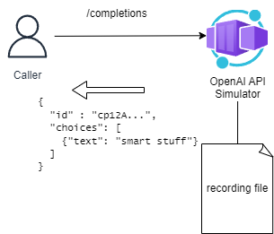
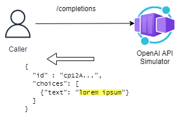

# aoai-simulated-api

This repo is an exploration into creating a simulated API implementation for Azure OpenAI (AOAI). This is a work in progress!

- [aoai-simulated-api](#aoai-simulated-api)
  - [What is the OpenAI Simulated API?](#what-is-the-openai-simulated-api)
  - [Overview](#overview)
    - [Record/Replay Mode](#recordreplay-mode)
    - [Generator Mode](#generator-mode)
  - [Read More](#read-more)
  - [Changelog](#changelog)

## What is the OpenAI Simulated API?

The OpenAI Simulated API is a tool that allows you to easily deploy endpoints that simulate the OpenAI API.
A common use-case for the OpenAI Simulated API is to test the behaviour your application under load.
By using the simulated API, you can reduce the cost of running load tests against the OpenAI API and ensure that your application behaves as expected under different conditions.

## Overview

The simulated API has two approaches to simulating API responses: record/replay and generators.
If you don't have any requirements around the content of the responses, the generator approach is probably the easiest for  you to use.
If you need to simulate specific responses, then the record/replay approach is likely the best fit for you.

### Record/Replay Mode

With record/replay, the API can be run in record mode to act as a proxy between your application and Azure OpenAI, and it will record requests that are sent to it along with the corresponding response from OpenAI. 

Once recorded, the API can be run in replay mode to use the saved responses without forwarding to Azure OpenAI. The recordings are stored in YAML files which can be edited if you want to customise the responses.

### Generator Mode

The simulated API can also be run in generator mode, where responses are generated on the fly. This is useful for load testing scenarios where it would be costly/impractical to record the full set of responses.

## Read More

There are various options for [running and deploying](./docs/running-deploying.md) the simulator, including running in Docker and deploying to Azure Container Apps.

There are a range of [configuration options](./docs/config.md) that can be applied to control the simulator behavior.

The simulated API supports [extensions](./docs/extensions.md) that allow you to customise the behaviour of the API. Extensions can be used to modify the request/response, add latency, or even generate responses.

## Changelog

For a list of tagged versions and changes, see the [CHANGELOG.md](./CHANGELOG.md) file.